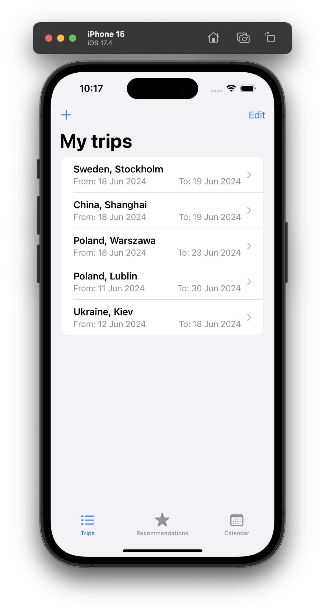
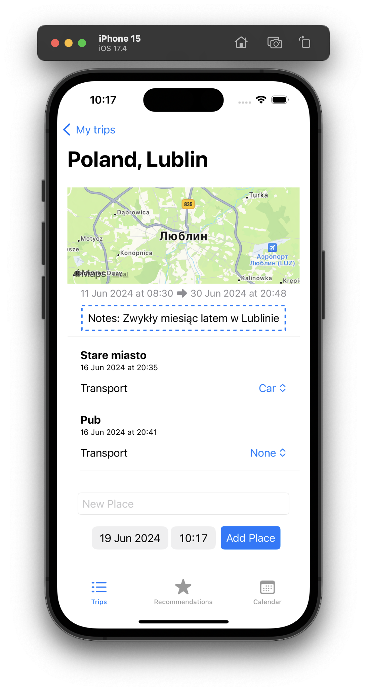
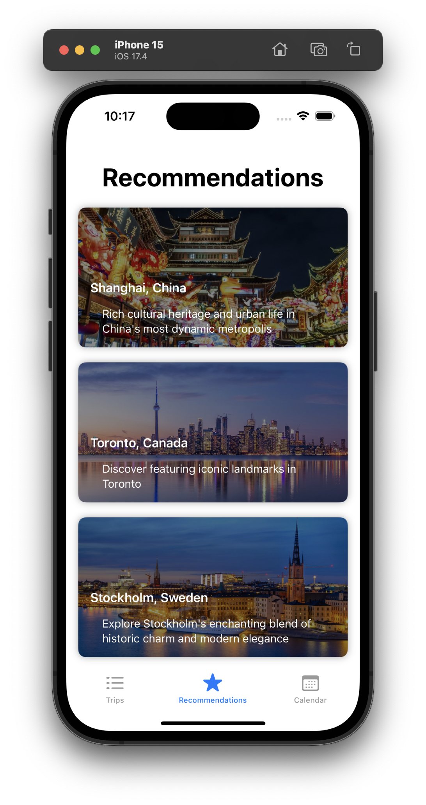
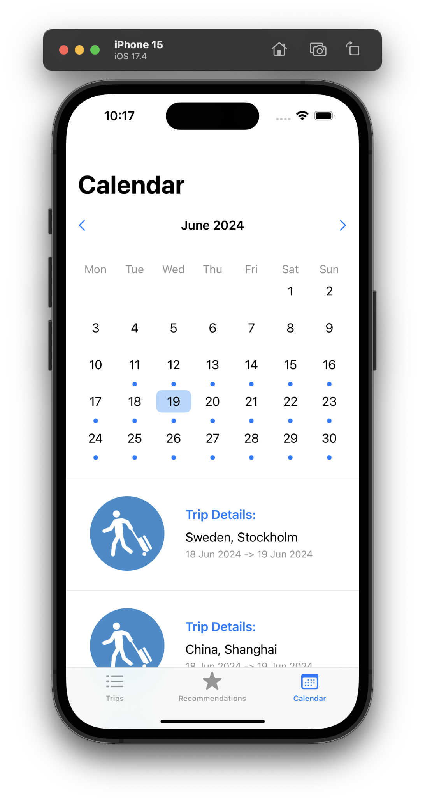

# iOS Travel Management App

IOS-Project is an iOS application designed to enhance your travel experience by seamlessly managing your trips and favorite places. Built using Core Data for robust data storage, IOS-Project ensures your travel memories are securely stored and easily accessible.

## Features

- **Trip Management**: Organize your trips with ease, including itinerary planning and trip details.
- **Place Tracking**: Save your favorite places visited during trips for quick access later.
- **Core Data Integration**: Utilizes Core Data framework for efficient data management and persistence.
- **User-friendly Interface**: Intuitive design for smooth navigation and enhanced user experience.

## How to Use

1. **Download**: Clone the repository to your local machine.

2. **Open in Xcode**: Navigate to the project directory and open `IOS-Project.xcodeproj` in Xcode.

3. **Build and Run**: Select your desired simulator or iOS device, build the project, and run the app.

## Requirements

- iOS 14.0+
- Xcode 12.0+
- Swift 5.0+

## Installation

To install IOS-Project on your iOS device:

1. Download the project from GitHub.
2. Open `IOS-Project.xcodeproj` in Xcode.
3. Connect your iOS device and select it as the deployment target.
4. Build and run the app on your device.

## Contributing

Contributions are welcome! If you have ideas for features or find any issues, please open an issue or submit a pull request.

## License

This project is licensed under the MIT License. See the [LICENSE](./LICENSE) file for more details.

## Contact

For questions or support, contact the maintainers:

- Email: maksim.shepeta@gmail.com

## Acknowledgments

We would like to thank the following libraries and resources:

- Apple Core Data Framework
- SwiftLint for code quality
- Icons8 for providing icons

## Screenshots

  
  
  
  

---

Feel free to customize this README.md to fit your project specifics and ensure it showcases your iOS travel app effectively on GitHub!
